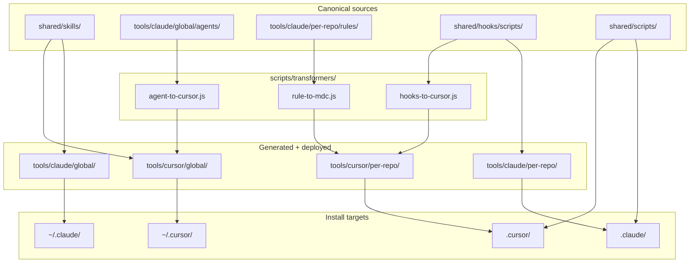

# Claude / Cursor Monorepo Restructure

## Current state

The repo is a **portable AI setup kit** (not an npm app). Today:

- [`global/agents/`](global/agents/) + [`global/skills/`](global/skills/) → `~/.claude/` via [`install.sh`](install.sh)
- [`per-repo/.claude/`](per-repo/.claude/) + [`per-repo/.cursor/`](per-repo/.cursor/) → target repos via [`setup-repo.sh`](setup-repo.sh)
- Rules are **manually duplicated** (`.md` vs `.mdc`) and already **drifting** (e.g. `security.md` has more paths than `security.mdc`)
- No transformers; Cursor skills/agents/hooks are **undocumented gaps** despite Cursor now supporting [`~/.cursor/agents/`](~/.cursor/agents/), [`~/.cursor/skills/`](~/.cursor/skills/), and [`.cursor/hooks.json`](.cursor/hooks.json)
- Known broken pieces: missing `block-secrets.sh`, missing `dependency-and-secrets-audit` skill



---

## Target directory layout

```
claude-automation-setup/
├── shared/                              # Tool-agnostic SSOT (no transforms)
│   ├── skills/                          # SKILL.md — identical for Claude + Cursor
│   ├── hooks/scripts/                   # block-secrets.sh, lint-after-write.sh
│   ├── scripts/                         # auto-commit.js, auto-pr.js, auto-jira.js, dashboard.js
│   ├── templates/
│   │   ├── AGENTS.md
│   │   └── .mcp.json
│   ├── husky/
│   └── github/workflows/
│
├── tools/
│   ├── claude/                          # Claude canonical (principal for transforms)
│   │   ├── global/
│   │   │   └── agents/                  # 12 agent .md files (move from global/agents/)
│   │   └── per-repo/
│   │       ├── rules/                   # *.md with paths: frontmatter
│   │       ├── hooks/                   # symlinks or copies → shared/hooks/scripts/
│   │       └── settings.json
│   │
│   └── cursor/                          # GENERATED + checked in (like codegen)
│       ├── global/
│       │   └── agents/                    # from agent-to-cursor.js
│       └── per-repo/
│           ├── rules/                   # *.mdc from rule-to-mdc.js
│           ├── hooks/                   # same scripts, cursor paths
│           └── hooks.json               # from hooks-to-cursor.js
│
├── scripts/
│   ├── transformers/
│   │   ├── agent-to-cursor.js
│   │   ├── rule-to-mdc.js
│   │   ├── hooks-to-cursor.js
│   │   └── index.js                     # runs all; exits non-zero on drift
│   ├── install-claude.sh                # refactor of install.sh
│   ├── install-cursor.sh              # NEW → ~/.cursor/agents + ~/.cursor/skills
│   ├── setup-repo.sh                    # deploy shared + both tool trees
│   └── setup-portability.sh             # move from per-repo/; add Windows fallback
│
├── package.json                         # minimal: "generate:cursor", yaml/markdown deps
├── install.sh                           # thin wrapper → scripts/install-claude.sh (backward compat)
└── docs/                                # update tool-compatibility.md, README, USAGE
```

**What stays outside `tools/`:** [`docs/`](docs/), [`.env.example`](.env.example), root README/USAGE. The old [`global/`](global/) and flat [`per-repo/`](per-repo/) folders are **removed after migration** (with a one-release deprecation note in README).

---

## Layer-by-layer strategy

### 1. Shared layer (zero duplication)

| Artifact | Location | Claude | Cursor |
|----------|----------|--------|--------|
| Skills | `shared/skills/*/SKILL.md` | copy → `~/.claude/skills/` | copy → `~/.cursor/skills/` |
| Automation scripts | `shared/scripts/*.js` | deploy → `scripts/` | same |
| Husky / GitHub Actions | `shared/husky/`, `shared/github/` | same | same |
| AGENTS.md / MCP | `shared/templates/` | deploy | deploy |
| Hook script bodies | `shared/hooks/scripts/` | referenced by both tool configs | same scripts, different registration |

Skills need **no transformer** — Cursor and Claude use the same `SKILL.md` + frontmatter format per [create-skill skill](~/.cursor/skills-cursor/create-skill/SKILL.md).

**Fix during migration:** add the missing [`dependency-and-secrets-audit/SKILL.md`](global/skills/) (referenced everywhere but absent).

### 2. Agents (Claude SSOT → Cursor generated)

**Canonical:** [`tools/claude/global/agents/*.md`](global/agents/backend-expert.md) (move existing 12 files)

**Transformer** [`scripts/transformers/agent-to-cursor.js`](scripts/transformers/agent-to-cursor.js):
- Input: Claude frontmatter (`name`, `description`, `tools`, `model`, `skills`)
- Output: Cursor subagent format — keep `name`, `description`, full markdown body
- Strip Claude-only frontmatter fields (`tools`, `model`); optionally append a short footer in body listing recommended skills from Claude frontmatter (since Cursor subagents don't auto-load skills)
- Write to `tools/cursor/global/agents/<name>.md`

**Install (user chose both scopes):**
- [`scripts/install-cursor.sh`](scripts/install-cursor.sh): copies `tools/cursor/global/agents/` → `~/.cursor/agents/` and `shared/skills/` → `~/.cursor/skills/`
- [`setup-repo.sh`](setup-repo.sh): optionally copies same agents into `.cursor/agents/` for team sharing (flag: `--with-cursor-agents` or always-on for team repos — recommend **always copy to per-repo** so clones are self-contained)

### 3. Rules (Claude SSOT → Cursor `.mdc`)

**Canonical:** `tools/claude/per-repo/rules/*.md`

Example canonical rule today:

```1:12:per-repo/.claude/rules/backend.md
---
paths: ["src/api/**", "src/services/**", "src/modules/**"]
---
# Convenciones Backend
...
```

**Transformer** [`scripts/transformers/rule-to-mdc.js`](scripts/transformers/rule-to-mdc.js):
- `paths:` → `globs:` (same array)
- Add `description:` derived from filename + first heading
- Set `alwaysApply: false`
- Preserve full rule body (fixes current drift where `.mdc` files are truncated)

**Workflow:** edit only `tools/claude/per-repo/rules/` → run `npm run generate:cursor` → commit both trees.

### 4. Hooks (shared scripts + format-specific registration)

**Canonical scripts:** move to `shared/hooks/scripts/`:
- `block-secrets.sh` — **implement** (referenced in settings but missing from repo)
- `lint-after-write.sh` — move from [`per-repo/.claude/hooks/post-tool-use/`](per-repo/.claude/hooks/post-tool-use/lint-after-write.sh)

**Claude registration:** `tools/claude/per-repo/settings.json` (unchanged schema, paths → `.claude/hooks/...`)

**Cursor registration:** transformer emits `tools/cursor/per-repo/hooks.json`:

```json
{
  "version": 1,
  "hooks": {
    "preToolUse": [{ "command": ".cursor/hooks/block-secrets.sh", "matcher": "Write|Edit" }],
    "postToolUse": [{ "command": ".cursor/hooks/lint-after-write.sh", "matcher": "Write|Edit" }]
  }
}
```

**Stdin compatibility:** Claude and Cursor hook JSON schemas differ slightly. Prefer one **format-agnostic** script in `shared/hooks/scripts/` that reads both field names (`tool` / `tool_name`, `file_path` / `path`), or add thin wrappers in each tool's `hooks/` folder generated by [`hooks-to-cursor.js`](scripts/transformers/hooks-to-cursor.js).

### 5. Per-repo deploy bundle

Refactor [`setup-repo.sh`](setup-repo.sh) to assemble from new paths:

1. Copy `shared/scripts/` → `<target>/scripts/`
2. Copy `shared/husky/`, `shared/github/workflows/`
3. Copy `shared/templates/AGENTS.md`, `.mcp.json` (if absent)
4. Copy `tools/claude/per-repo/` → `<target>/.claude/` (rules, settings, hook script copies)
5. Copy `tools/cursor/per-repo/` → `<target>/.cursor/` (rules, hooks.json, hook scripts, agents)
6. Run `setup-portability.sh` automatically (today it's a manual step — fold into setup-repo)
7. Add `.cursor/skills/` as **symlinks or copies** of `shared/skills/` for repo-local skill discovery (optional but helps team parity without global install)

---

## Scripts to add or refactor

| Script | Action |
|--------|--------|
| [`scripts/transformers/index.js`](scripts/transformers/index.js) | Orchestrates all transforms; `--check` mode for CI drift detection |
| [`scripts/install-claude.sh`](scripts/install-claude.sh) | Refactor [`install.sh`](install.sh): `tools/claude/global/agents/` + `shared/skills/` → `~/.claude/` |
| [`scripts/install-cursor.sh`](scripts/install-cursor.sh) | **New:** `tools/cursor/global/agents/` + `shared/skills/` → `~/.cursor/` |
| [`install.sh`](install.sh) | Keep as alias/wrapper for backward compatibility |
| [`setup-repo.sh`](setup-repo.sh) | Point to new paths; auto-run portability; deploy both tool trees |
| [`setup-portability.sh`](setup-portability.sh) | Move to `scripts/`; add PowerShell sibling [`setup-portability.ps1`](scripts/setup-portability.ps1) for Windows (junction/copy fallback when `ln -sf` fails) |
| Root [`package.json`](package.json) | `"generate:cursor": "node scripts/transformers/index.js"`, `"generate:cursor:check": "... --check"` |

Reuse patterns from existing Node scripts ([`per-repo/scripts/auto-commit.js`](per-repo/scripts/auto-commit.js)) for YAML frontmatter parsing (use `gray-matter` or minimal regex to avoid heavy deps).

---

## Cursor parity matrix (after restructure)

| Capability | Claude | Cursor (target) | Mechanism |
|------------|--------|-----------------|-----------|
| Project instructions | AGENTS.md | AGENTS.md (native) | `shared/templates/` |
| Skills (11+) | `~/.claude/skills/` | `~/.cursor/skills/` + optional `.cursor/skills/` | `shared/skills/` copy, no transform |
| Subagents (12) | `~/.claude/agents/` | `~/.cursor/agents/` + `.cursor/agents/` | transformer from Claude agents |
| Path-scoped rules | `.claude/rules/*.md` | `.cursor/rules/*.mdc` | transformer from Claude rules |
| MCP | `.mcp.json` | `.cursor/mcp.json` symlink | existing portability script |
| Tool hooks | `.claude/settings.json` | `.cursor/hooks.json` | transformer + shared scripts |
| Git hooks | Husky | Husky | `shared/husky/` |
| Automation | `scripts/*.js` | same | `shared/scripts/` |

**Still Claude-only (document in AGENTS.md, no fake parity):** progressive skill auto-discovery, parallel subagent orchestration with isolated context budgets, Claude-specific `model` routing in agent frontmatter.

---

## Migration steps (execution order)

### Phase A — Restructure without behavior change
1. Create `shared/`, `tools/claude/`, `tools/cursor/`, `scripts/transformers/`
2. Move `global/agents/` → `tools/claude/global/agents/`
3. Move `global/skills/` → `shared/skills/`
4. Move `per-repo/.claude/rules/` → `tools/claude/per-repo/rules/`
5. Move `per-repo/scripts/` → `shared/scripts/`; husky/workflows → `shared/`
6. Move templates (`AGENTS.md`, `.mcp.json`, `setup-portability.sh`) → `shared/templates/` + `scripts/`
7. Update [`install.sh`](install.sh) paths; verify global install still works

### Phase B — Build transformers + generate Cursor tree
1. Implement `rule-to-mdc.js`, `agent-to-cursor.js`, `hooks-to-cursor.js`
2. Run `npm run generate:cursor`; commit `tools/cursor/`
3. Implement missing `block-secrets.sh` in `shared/hooks/scripts/`
4. Add missing `dependency-and-secrets-audit/SKILL.md`

### Phase C — Install + deploy scripts
1. Add `install-cursor.sh` (global)
2. Refactor `setup-repo.sh` to deploy both trees + auto-run portability
3. Add `setup-portability.ps1` for Windows
4. Keep `install.sh` as wrapper

### Phase D — Validation + docs
1. Add CI job (or local check): `npm run generate:cursor:check` fails if `tools/cursor/` is stale
2. Update [`README.md`](README.md), [`USAGE.md`](USAGE.md), [`docs/tool-compatibility.md`](docs/tool-compatibility.md) with new layout and dual-install flow
3. Update [`per-repo/AGENTS.md`](per-repo/AGENTS.md) template → `shared/templates/AGENTS.md`: document Cursor subagents path and that skills live in both `~/.cursor/skills/` and optional `.cursor/skills/`
4. Remove deprecated `global/` and flat `per-repo/` after verifying migration

---

## Developer workflow (post-migration)

```bash
# One-time per machine
./install.sh              # → ~/.claude/agents + ~/.claude/skills
./scripts/install-cursor.sh   # → ~/.cursor/agents + ~/.cursor/skills

# After editing canonical Claude artifacts or shared skills
npm run generate:cursor   # refresh tools/cursor/ from tools/claude/
git add tools/cursor/     # commit generated output

# Per project
./setup-repo.sh           # deploys .claude/, .cursor/, scripts/, symlinks
```

**Edit rules here:** `tools/claude/per-repo/rules/backend.md`  
**Never edit directly:** `tools/cursor/per-repo/rules/backend.mdc` (generated)

---

## Risks and mitigations

| Risk | Mitigation |
|------|------------|
| Generated Cursor files drift from canonical | `generate:cursor:check` in CI; document "do not edit" in `tools/cursor/README.md` |
| Hook stdin format differences | Shared parser logic in hook scripts; test both tools once |
| Windows symlinks fail | PowerShell script with copy fallback; document Git Bash option |
| Breaking existing users mid-migration | Keep `install.sh` wrapper; migration PR with path mapping table in README |
| Cursor subagents lack skill auto-load | Transformer appends "Required skills: …" section to agent body from Claude frontmatter |

---

## Out of scope (unless you ask later)

- Copilot/Gemini/Codex dedicated folders (continue symlinks via `setup-portability.sh`)
- Renaming the repo from `claude-automation-setup`
- npm workspaces / turbo monorepo tooling (unnecessary for this kit)
